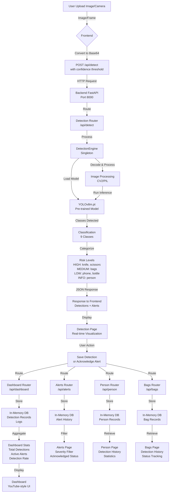
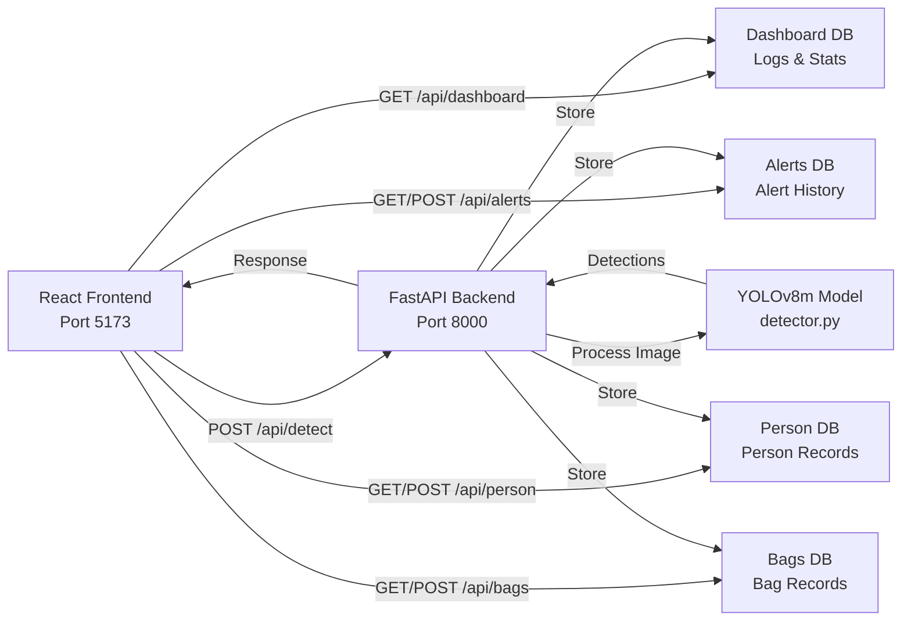

# ThreadVision - Data Flow Architecture

## Complete System Data Flow



## Data Flow Stages

### Stage 1: Image Input
- User uploads image or activates camera on Detection page
- Browser converts image to **Base64** encoding
- Sets confidence threshold (default: 0.25)

### Stage 2: Detection Request
```json
POST /api/detect
{
  "image": "base64_encoded_image",
  "confidence": 0.25
}
```

### Stage 3: Backend Processing
1. **Detection Router** receives request
2. **DetectionEngine** (Singleton pattern):
   - Decodes Base64 image
   - Converts to OpenCV format (RGB → BGR)
   - Loads YOLOv8m model (cached in memory)
3. **YOLO Inference** runs on image

### Stage 4: Object Classification
9 detected classes categorized by risk level:

| Risk Level | Classes | Color |
|-----------|---------|-------|
| **HIGH** 🔴 | Knife, Scissors | Red |
| **MEDIUM** 🟠 | Backpack, Handbag, Suitcase, Bag | Yellow |
| **LOW** 🟡 | Bottle, Cell Phone | Orange |
| **INFO** 🟢 | Person | Green |

Each detection includes:
- Class name
- Confidence score (0-1)
- Bounding box coordinates [x1, y1, x2, y2]

### Stage 5: Response & Visualization
```json
{
  "detections": [
    {
      "class": "person",
      "confidence": 0.92,
      "bbox": [100, 50, 300, 400]
    },
    {
      "class": "backpack",
      "confidence": 0.87,
      "bbox": [250, 100, 350, 300]
    }
  ],
  "processedImage": "base64_with_bounding_boxes",
  "hasAlert": true,
  "alertType": "Suspicious Bag Detected"
}
```

Frontend draws bounding boxes on image with color-coded risk levels.

### Stage 6: Data Storage (In-Memory)
User can save detections to different databases:

- **Dashboard Router** → Detection Records & Logs
- **Alerts Router** → Alert History
- **Person Router** → Person Detection Records
- **Bags Router** → Bag/Luggage Records

### Stage 7: Dashboard Aggregation
Statistics computed from stored data:
```json
{
  "totalDetections": 156,
  "activeAlerts": 12,
  "personsDetected": 89,
  "bagsDetected": 42,
  "dangerousDetected": 3,
  "detectionRate": 99.2
}
```

### Stage 8: UI Rendering
Pages display aggregated data:
1. **Dashboard** - Overview of stats and recent detections
2. **Detection** - Real-time image/camera feed processing
3. **Alerts** - Filter by severity/acknowledgment status
4. **Person** - Historical person detection records
5. **Bags** - Monitor bag detections and update status
6. **Logs** - View activity history
7. **Settings** - Configure detection parameters

## Component Interaction Map



## API Endpoints Reference

| Method | Endpoint | Purpose | Response |
|--------|----------|---------|----------|
| POST | `/api/detect` | Process image for object detection | Detections + Processed Image |
| GET | `/api/dashboard` | Get aggregated statistics | Stats object |
| GET | `/api/alerts` | Get alert history with filters | Alert array |
| POST | `/api/alerts/{id}/acknowledge` | Mark alert as reviewed | Updated alert |
| GET | `/api/person` | Get person detection records | Person records array |
| POST | `/api/person` | Save new person detection | Created record |
| GET | `/api/person/stats` | Get person statistics | Stats object |
| GET | `/api/bags` | Get bag detection records | Bag records array |
| POST | `/api/bags` | Save new bag detection | Created record |
| PUT | `/api/bags/{id}/status` | Update monitoring status | Updated bag record |
| GET | `/health` | Health check | Status object |

## Key Features of Data Flow

### Real-time Processing
- Camera frames processed at ~30 FPS (requestAnimationFrame)
- Timeout fallback to demo mode if API unavailable
- Confidence threshold adjustable per detection

### Risk-based Alerts
- **HIGH**: Dangerous objects trigger immediate alert
- **MEDIUM**: Suspicious bags flagged for review
- **LOW**: General items logged for records
- **INFO**: Person detections for presence tracking

### Stateful Management
- In-memory database for fast access
- Singleton pattern for YOLO model (loaded once)
- Detection history maintained per session

### Frontend-Backend Communication
- Base64 image encoding/decoding
- JSON request/response format
- CORS enabled for cross-origin requests
- Error handling with fallback demo data
